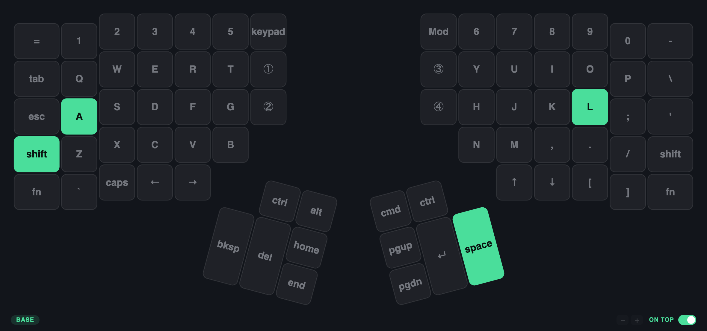
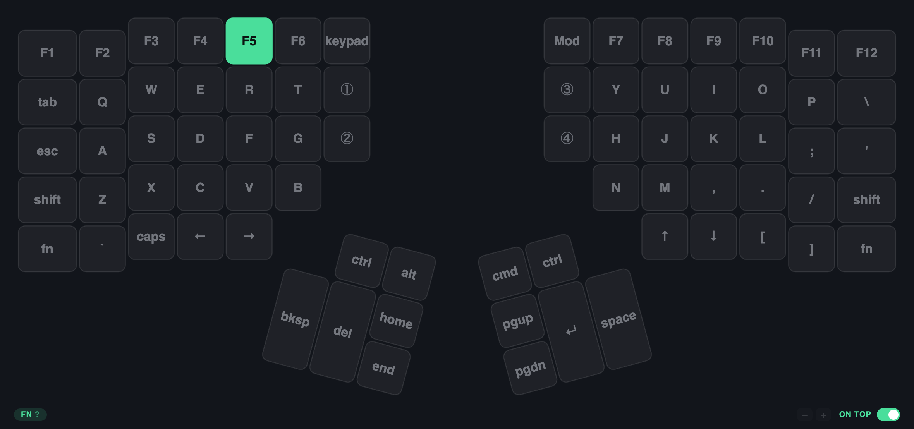
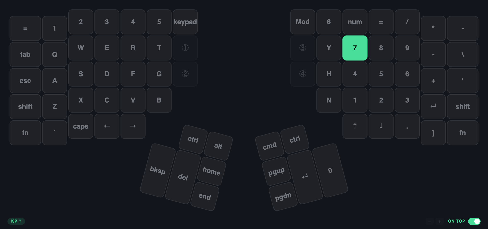

# kinesis-360-mirror

An on-screen mirror of the Kinesis Advantage 360 Pro. Keys light up as you
press them, so you can keep your eyes on the screen instead of hunting on the
board.

macOS and Linux. Tauri v2 — Rust for capture, SVG for the board.



## The keyboard

- [Kinesis Advantage360 Professional](https://kinesis-ergo.com/keyboards/advantage360/)
  — the hardware this mirrors.
- [KinesisCorporation/Adv360-Pro-ZMK](https://github.com/KinesisCorporation/Adv360-Pro-ZMK)
  — the official firmware config. **This repo's key geometry and legends are
  generated from it**, so the on-screen board is derived from the real
  firmware rather than redrawn by hand.
- [ZMK](https://zmk.dev) — the firmware the Pro runs, and the reason layers
  are resolved onboard instead of on the host.

Only the **Advantage360 Professional** (ZMK) is supported. The non-Pro
Advantage360 runs Kinesis' SmartSet firmware and stores its layout differently.

## Why it works the way it does

The 360 Pro resolves its own layers and remaps **onboard**, in firmware. The
host never sees "the key at row 3, column 2" — it sees whatever HID usage the
firmware decided to send. Three consequences shape the whole design:

1. **Geometry and legends are generated from the firmware config**, not drawn
   by hand. `tools/gen_layout.py` parses the upstream ZMK devicetree so the
   on-screen board matches what is actually flashed. Re-run it against your own
   fork after you change your keymap.

2. **Highlighting is exact, not guessed.** Building the usage→position map from
   the stock keymap yields **zero ambiguous usages** — every one of the 76 keys
   is uniquely identified by the code it emits. No layer tracking needed to
   know which key you hit.

3. **Layer state is genuinely invisible.** A momentary-layer key (`&mo`) emits
   no HID report at all, and this firmware exposes no vendor-defined HID page
   (usage pages present are only 1, 7, 8, 9, 12 — so no ZMK Studio raw-HID
   endpoint to query). The layer badge is therefore *inferred*: when a usage
   arrives that only exists on one non-base layer — F-keys imply `Fn`, `KP_*`
   implies `Kp` — the display switches and marks itself with `?`. It lags the
   first keypress on a layer by definition. If you want it exact, bind your
   layer keys to also emit an unused code (F20–F23) and key off that.

## Setup

Prerequisites: [Rust](https://rustup.rs), [Bun](https://bun.sh), and on macOS
the Xcode command line tools (`xcode-select --install`).

```bash
git clone https://github.com/<you>/kinesis-360-mirror
cd kinesis-360-mirror
bun install
bun run tauri dev
```

To install it properly on macOS — build, copy to `/Applications`, relaunch:

```bash
cp .signing.env.example .signing.env   # then edit in your own identity
bun run install:mac
```

`.signing.env` is gitignored because it names a personal certificate. The
build works without it, but see the signing section below — unsigned means
re-granting Input Monitoring after every single build.

### macOS: Input Monitoring

Capture uses `IOHIDManager` with a non-exclusive input-value callback, which
needs the Input Monitoring grant (`kTCCServiceListenEvent`) — a weaker
permission than the Accessibility grant a `CGEventTap` would require.

The grant is keyed to the **app bundle**, so grant it to the built `.app`
rather than to your terminal:

```bash
bun run tauri build --bundles app
open src-tauri/target/release/bundle/macos/kinesis-360-mirror.app
```

#### Sign it, or you re-grant on every build

TCC identifies an **ad-hoc signed** app by its CDHash, which changes every
single rebuild — so each build looks like a brand-new app and the previous
grant no longer applies. Signing with a real certificate fixes this, because
the designated requirement then contains no CDHash:

```
identifier "com.agomez.kinesis-360-mirror" and anchor apple generic
  and certificate leaf[subject.CN] = "Apple Development: …"
```

Set `bundle.macOS.signingIdentity` in `tauri.conf.json` to an identity from
`security find-identity -v -p codesigning`. Verified: after signing, a rebuild
that genuinely changes the binary keeps the grant.

**The trap:** an existing TCC record from the ad-hoc days is pinned to the old
CDHash and does *not* match the newly signed app — but System Settings still
displays it, toggled on, so it looks like the permission is granted when it is
not. Delete the stale entry and grant once more:

```bash
tccutil reset ListenEvent com.agomez.kinesis-360-mirror
```

Only then does the certificate-based record get created. Losing an afternoon
to this is easy, because every visible signal says the permission is fine.

`IOHIDManagerOpen failed: 0xe00002e2` in the log means exactly this permission
is missing (`kIOReturnNotPermitted`).

Note the UI never trusts TCC alone: the gate re-polls every 2s and dismisses
itself as soon as a key event arrives, because `IOHIDCheckAccess` can report
`unknown` transiently and a one-shot check strands you behind a gate for a
permission you already granted.

### Linux: device access

Capture reads `/dev/input/event*` via evdev, which sits below the compositor
and so works on Wayland as well as X11. You need read access:

```
# /etc/udev/rules.d/70-kinesis-360-mirror.rules
KERNEL=="event*", ATTRS{idVendor}=="29ea", ATTRS{idProduct}=="0362", TAG+="uaccess"
KERNEL=="event*", ATTRS{idVendor}=="1d50", ATTRS{idProduct}=="615e", TAG+="uaccess"
```

Then `sudo udevadm control --reload-rules && sudo udevadm trigger`. Adding
yourself to the `input` group works too, but grants rather more than this needs.

## Using it

Launch it, put it where you can see it without looking down, and type. Keys
light up as you press them and fade out as you release, so a fast chord stays
readable for a moment instead of flickering past.

The board is only ever a mirror. It shows what you pressed; it cannot press
anything. Clicking an on-screen key does nothing by design — see
[Privacy](#privacy).

### Layers

Legends repaint to the active layer, using the names from your own keymap.
Pressing an F-key implies the `Fn` layer, so the whole board relabels:



A keypad usage does the same for `Kp`:



The `?` next to the badge is not decoration — it marks the layer as *inferred*.
The keyboard never tells the computer which layer it is on, so this is worked
out from keys that only one layer can produce, and it lags by one keypress.
Key highlighting itself is always exact.

### Controls

A normal window, always on top by default, draggable anywhere on its body
rather than only by the title bar.

- **on top** — the switch in the status bar. Also in the tray.
- **− / +** — step the window size. The board always scales to fit on its own;
  these resize the window along the board's own proportions so it never sits in
  a letterboxed gap. Your size is remembered, including when you drag the edge.
- **Red button hides, it does not quit.** Closing the only window would leave
  the app running with no way back, so use the tray to bring it back or quit.
- **Click-through** (tray) — makes the window ignore the mouse entirely, so it
  never eats a click meant for the editor underneath.
- **Layer badge** — the active layer of your keymap. A `?` means it was
  inferred rather than observed; see above for why it has to be.

Hover the layer badge or the on-top switch for an explanation in place.

## Not supported

Being explicit, so nobody installs this expecting something it does not do:

- **Any keyboard other than the Advantage360 Pro.** Capture is filtered to the
  Kinesis vendor/product IDs, so your laptop's built-in keyboard lights up
  nothing. That is deliberate — the board on screen would otherwise lie.
- **The non-Pro Advantage360.** It runs Kinesis' SmartSet firmware, which
  stores its layout differently. Only the ZMK-based **Pro** is handled.
- **Windows.** The capture layer is macOS (IOHIDManager) and Linux (evdev).
  A Windows backend would be a third implementation, not a port.
- **Typing on your behalf.** It holds the *listen* permission and deliberately
  not the *post events* one, so it structurally cannot synthesize a keystroke.
- **Exact layer state.** A momentary-layer key sends nothing to the computer,
  so the layer badge is inferred and lags by one keypress. Key highlighting is
  always exact; only the label is a guess.
- **The concave key well.** The board is drawn flat. Positions match the
  official layout, but the real hardware's bowl and column splay are not
  represented, because upstream's `physical_layout` does not encode them.
- **Installation from any app store.** Distribution is a signed, notarized DMG
  from [Releases](../../releases), or a build from source. See below.
- **Your custom keymap, until you regenerate.** The legends and geometry come
  from the stock config; re-run the generator against your own fork.

## Regenerating assets after a keymap change

```bash
git clone --depth 1 https://github.com/KinesisCorporation/Adv360-Pro-ZMK
python3 tools/gen_layout.py ./Adv360-Pro-ZMK -o src/assets
```

It reports any keycode it could not map to a HID usage as `UNMAPPED` — extend
the `USAGE` table in the script when you add exotic keycodes.

## Layout of the code

| Path | What it does |
| --- | --- |
| `tools/gen_layout.py` | ZMK devicetree → `layout.json` + `keymap.json` |
| `src-tauri/src/hid/macos.rs` | `IOHIDManager` capture, hand-bound to IOKit |
| `src-tauri/src/hid/linux.rs` | evdev capture, with Linux keycode → HID usage table |
| `src-tauri/src/lib.rs` | Tauri wiring, tray, duplicate-press suppression |
| `src/main.js` | SVG board, afterglow, layer inference |
| `src-tauri/examples/probe.rs` | Headless capture check — no GUI |

### Debugging

`cargo run --example probe` prints raw usages for 10 seconds with no window in
the way. In the frontend, `__mirror.onKey({usage: 0x04, down: true})` drives the
board from the web inspector with no keyboard attached.

## Cutting a release

Distribution is a DMG from [Releases](../../releases) — download, drag to
`/Applications`, grant Input Monitoring. There is no app-store route: stores
require the App Sandbox, and a sandboxed app cannot hold Input Monitoring, so
the capture this app exists to do would not work. That is a permanent
constraint, not a to-do.

Which puts the burden on the DMG standing up by itself. Gatekeeper refuses a
downloaded app unless it is signed with a **Developer ID Application**
certificate *and* notarized by Apple — a different certificate from the
`Apple Development` one used for local builds. Create it in your Apple
Developer account, add it and the notarization credentials to `.signing.env`:

```sh
export APPLE_SIGNING_IDENTITY="Developer ID Application: … (TEAMID)"
export APPLE_ID="you@example.com"
export APPLE_PASSWORD="app-specific-password"   # appleid.apple.com
export APPLE_TEAM_ID="TEAMID"
```

then:

```bash
sh scripts/release-mac.sh
```

That builds the DMG, and then **verifies** the result rather than trusting the
build log — `codesign --verify`, `spctl --assess`, and `stapler validate`. The
last one is the step that gets skipped: without a stapled ticket the DMG opens
fine on your machine, where it was built, and fails on everyone else's. The
script refuses to publish if the ticket is missing, and it creates the release
as a **draft** so you can look before it is public.

Users without any of this can still build from source, which is the more
trustworthy path anyway — see [SECURITY.md](SECURITY.md).

Linux needs no certificates at all: ship an AppImage or `.deb`, plus the udev
rule above.

## Regenerating the screenshots

```bash
sh tools/make_screenshot.sh
```

Renders the real frontend in headless Chrome rather than capturing a desktop
window, so the images stay reproducible and free of clutter. It uses the
`?demo=<hex usages>` parameter to light keys with no keyboard attached.

## Icon

The icon is the 🔤 emoji, rendered via AppKit (PIL cannot draw Apple Color
Emoji) and expanded by `tauri icon`:

```bash
swift tools/make_icon.swift 🔤 /tmp/icon.png
bun run tauri icon /tmp/icon.png
```

Swap the emoji to rebrand.

## License

MIT — see [LICENSE](LICENSE).

## Privacy

This is a keylogger by construction, so don't take my word for what it does.

It keeps nothing: no disk writes, no network code in the binary at all, no
persistence of what you typed. Events go from the HID callback straight to the
renderer and are dropped. It only ever sees the Kinesis, and it holds the
*listen* permission and deliberately not the *post events* one — so it
structurally cannot type on your behalf, even if it wanted to.

**[SECURITY.md](SECURITY.md) shows you how to verify every one of those claims
yourself**, in about a minute, with grep and `lsof`. It also documents the
permissions requested, the IPC surface, and the `unsafe` blocks.

## Status

The mirror works. What would actually make you *faster* is the inverse — prompt
a key, time the press, and track per-key latency and error rate, which tells you
which keys you are still hunting for. That is not built yet.

Verified: macOS capture and app bundle build and run; the board renders and
highlights correctly. The Linux capture module is cross-checked against
`x86_64-unknown-linux-gnu` but has not been run on real hardware, and the full
Tauri app on Linux additionally needs the GTK/WebKit system libraries.
